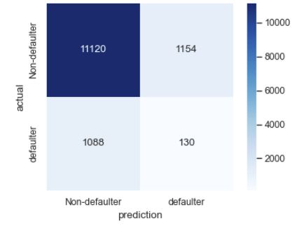
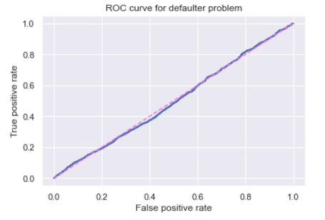

## Predict Loan Defaulter

### Goal:
This analysis aims at establishing a predictive classification model to whether a customer is a loan defaulter or not. The data set from Kaggle presents the defaulter only comprises 9% of the entire population. Also, there are approximately 30 features need to be considered and categorized. The model is anticipated to 
have accepatable accuracy, recall, presision, and F1/F-beta metrics when determine the loan defaulter. In this MVP, only Logistic Regression method is applied, Random Forest, other boosted tree models and KNN will be presented in the final project.
### Process:
The data set selected for this analysis was obrained from Kaggle. This data set comprised of over 60K data points with over 30 features. The data set is a mix of both quantitative and qualitative feature. After preliminary cleaning, the categorical features were binarized with "get_dummies" command and dropped the first category. Due to the low percentage of the defaulter, the imbalanced data set was oversampled. Logistic Regression method was performed and evaluation metrics were calculated and presented including: Confusion Matrix, Precision and Recall Curves, ROC Curves, and AUC score.

### Preliminary Conclusions:

After modest feature engineering, there left 140 features for conducting classification. THe confusion matrix shown too large values on the False Negative - False Positive Diagonal. THe presision and Recall Curves were not in a perfect smooth curve due to the properties of the data set and is anticipated to improve with a better model. The ROC curve shows that the current model prediction is similar to a random guess. The Confusion matrix and the ROC curve for the oversampled data set is presented below.  

### Next Steps:
1. A better feature engineering will be performed (including a pair plot at the beginning).
2. SMOTE will also be applied to remedy class imbalance.
3. Random Forest, other boosted tree models and KNN will also be used and compared in the end.

